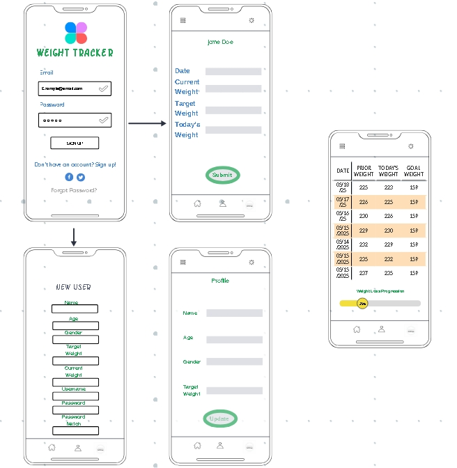
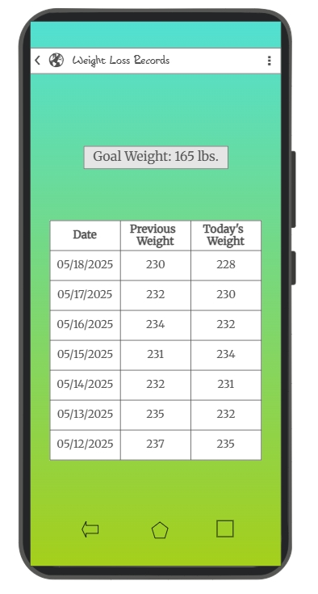

# Design evolution

These wireframes were created during the original CS 360 project and are preserved as design-history artifacts. They demonstrate the initial account, profile, data-entry, record-table, and navigation concepts. They are not screenshots of the rebuilt Android application.

## Original multi-screen user flow

The first concept connected account access, profile setup, daily input, and a compact progress view. The portfolio rebuild keeps the short workflow but removes social sign-in and cloud-dependent password recovery because the finished app is intentionally offline.

## Original records concept

The records study emphasized goal visibility and recent trend comparison. The rebuilt app replaces the fixed seven-row table with a scrollable record list, complete editing and deletion, and calculated progress for both weight-loss and weight-gain goals.

## What changed in implementation

- Fixed-size mockup screens became responsive Material layouts.
- Placeholder identity fields were reduced to a local username, password, and goal.
- Static table rows became per-user SQLite records.
- The progress concept became a tested calculation based on the oldest and newest records.
- The early high-contrast palette was replaced with an accessible teal neutral system with dark-mode support.
- A local goal notification replaced the proposed SMS behavior, avoiding phone-number collection and SMS permission.
