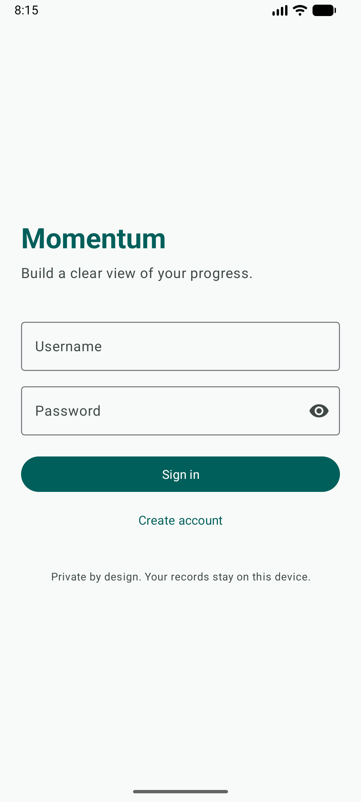
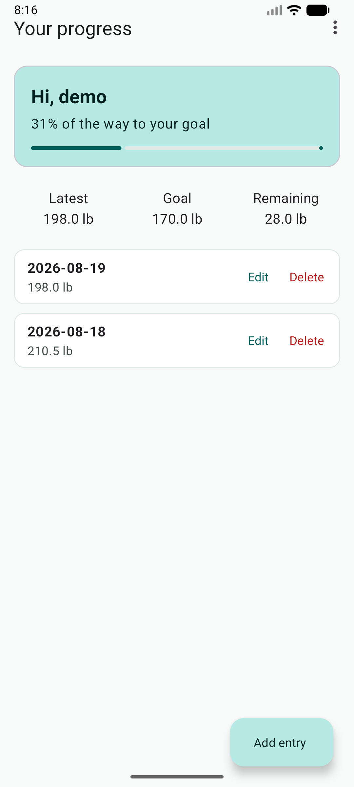
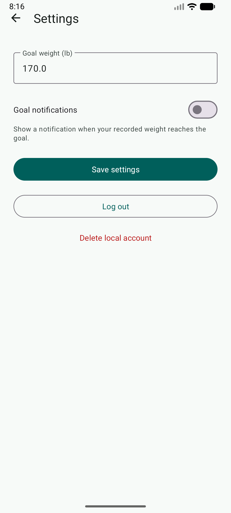

# Momentum Weight Tracker

Momentum is a privacy-first Android application for recording daily weight, setting a personal goal, and reviewing progress over time. It is a portfolio modernization of an original CS 360 mobile architecture project.

[](https://github.com/PhantomOSG-25/CS-360-Mobile-Architecture-and-Programming/actions/workflows/android.yml)

## Application preview

<p align="center">
  
  
  
</p>

Additional reviewed views: [create a local account](docs/screenshots/create-account.png) and [add a weight entry](docs/screenshots/add-entry.png).

## What it demonstrates

- Native Android development in Java with Material components
- Local relational persistence with SQLite and per-user data isolation
- Password protection using salted PBKDF2 hashes rather than stored plaintext
- Create, read, update, and delete workflows for weight records
- Input validation, duplicate-date handling, session management, and goal-reached notifications
- A layered structure that separates screens, persistence, security, models, and testable calculations
- Automated unit tests and a repeatable GitHub Actions build

## Core user flow

1. Create a local account and choose a goal weight.
2. Sign in without sending personal data to a server.
3. Add one weight record per date.
4. Edit or delete records and review progress toward the goal.
5. Choose whether the app may show a notification when the goal is reached.

## Run locally

Requirements: Android Studio with Android SDK 36, Build-Tools 35.0.0, and JDK 17 or newer.

1. Open the repository root in Android Studio.
2. Allow Gradle to synchronize.
3. Run the `app` configuration on an emulator or device running Android 8.0 (API 26) or newer.

From a terminal, the verification commands are:

```text
./gradlew test
./gradlew lint
./gradlew assembleDebug
```

The final private review ran `test`, `lint`, and `assembleDebug` against Android SDK 36. All 16 unit-test executions passed, Android lint reported no issues, and an API 36 emulator smoke test completed registration, local persistence, create/read/update/delete behavior, progress calculation, and settings navigation.

## Privacy and security

Momentum is intentionally offline. It requests no internet, location, contacts, or SMS permissions. Account data and weight records stay in the app's private SQLite database. Android backup is disabled, activities are not exported, and passwords are stored only as salted PBKDF2 hashes. See [SECURITY.md](SECURITY.md) for the threat model and limitations.

## Project history

The initial coursework established the product concept, wireframes, and an early Android prototype. The portfolio version was rebuilt after the course to complete persistence, navigation, security, CRUD behavior, accessible styling, tests, and documentation. See [PROJECT_HISTORY.md](PROJECT_HISTORY.md) for a precise original-versus-modernized breakdown.

## Architecture

See [ARCHITECTURE.md](ARCHITECTURE.md) for component responsibilities, data flow, and design tradeoffs.

## Design evolution

The repository preserves two privacy-reviewed wireframes from the original coursework to show the early user-flow and information-architecture decisions. They are explicitly labeled as concepts rather than application screenshots. See [DESIGN_EVOLUTION.md](DESIGN_EVOLUTION.md).

## Scope and limitations

This is an educational portfolio application, not a medical product. It does not provide medical advice, cloud synchronization, password recovery, or multi-device backup. The app favors transparent platform APIs and a compact codebase over production-scale dependency injection or an ORM.
